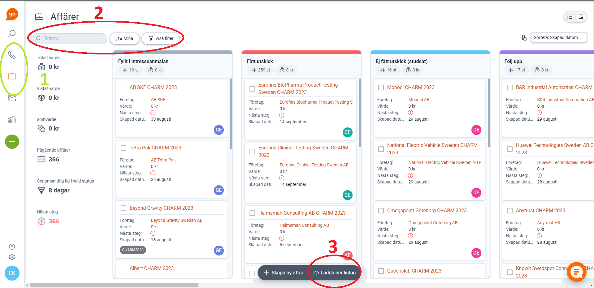
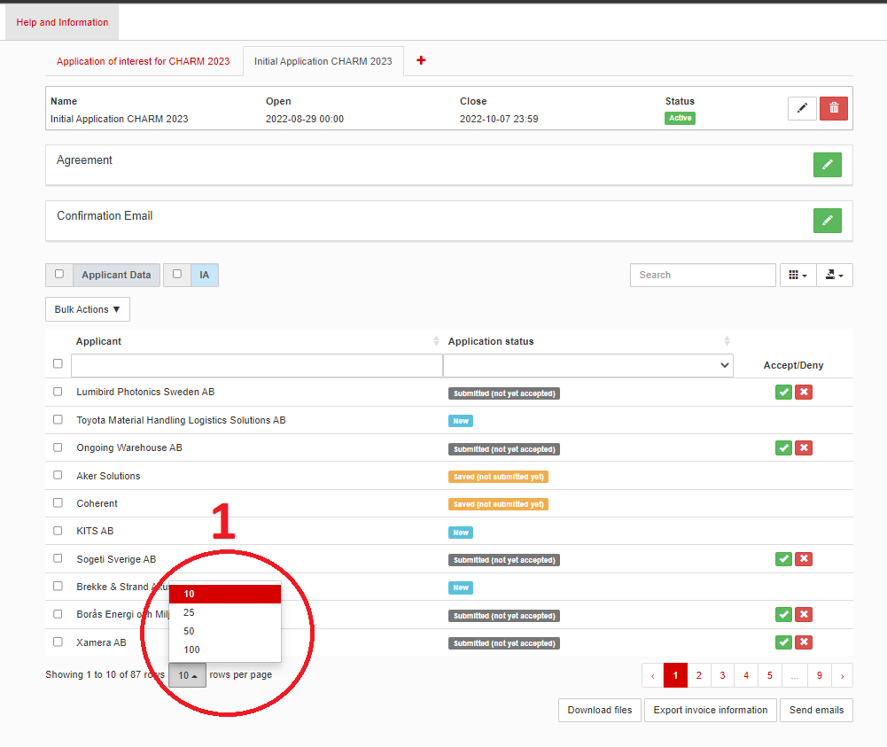
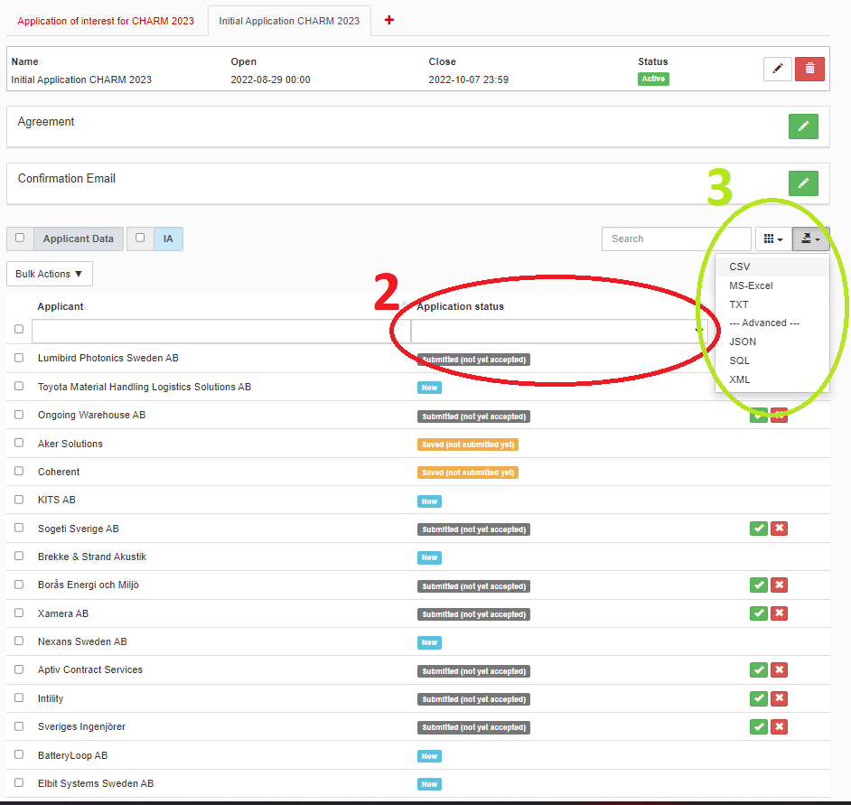

# Verktyg för att kolla diff mella lime och anmälningssystemet

Mer specifikt är detta ett python-script som gör en jämförelse på två olika filstrukturer, en från Lime och en från vårat egna Anmälningssystem

## Requirements

För att kunna använda detta verktyg måste du ha python instalerat, samt några python bibliotek. Dessa bibliotek kan enkelt installeras med:

``pip install pygame``

``pip install tk``

## Användning

Först behöver du göra två utdrag, ett från Lime och ett från anmälningssystemet.

###### Lime

1. Gå till "Affärer" i Lime
2. Se till att dina filter är helt tomma
3. Klicka på "Ladda ner listan" (Den kan vara lite långsam)

Nu har du ett utdrag frpn lime nedladdat!

###### Anmälningssystemet

1. Se till att du visar alla företagens anmälningar
2. Se till att "Application status är tom
3. Klicka på knappen med pilen p åoch sendan på "CSV"

Nu har du ett utdrag från anmälningssystemet nedladdat och kan börja köra diffen!

För att starta programmet så behöver du stå i mappen där denna filen ligger och sedan köra kommandot

``python src/comp.py``

Därefeter kan du välja på tre saker:

* Jämföra två utrag, ett från lime och ett från anmälningssystemet; "Run diff from files".
  * Här kommer du få upp ett fönster där du först ska välja utdraget från lime
  * Därefter öppnas ett nytt fönster som ber dig öppna utdraget från hemsidan
  * Efter detta får du en textfil, "result.txt", som öppnas automatisk och är uppdelad i två kategorier; "Företag i lime men inte i anmälningssystemet" och ""Företag i anmälningssystemet men inte i Lime". Det betyder att till exempel så har ett företag gjort klart sin anmälan men affären är inte flyttad till rätt status i Lime.
* Uppdatera listan med namn på företag som är samma men heter olika i de olika systemen; "Edit known diffs".
  * Här kommer du få upp en texteditor där du kan lägga in företagsnamn som skiljer sig i anmälningssystemet och Lime.
    * Om du hittar ett nytt företag är det bara att lägga till en ny rad med båda företagsnamnen med ett komma emellan dem
* Uppdatera listan av affärsstatusar som ska tas med från lime. (detta gör att vi kommer kunna använda samma program under FA:n); "Edit LimeStatus"
  * Här får du återigen upp en text editor där du kan lägga till eller ta bort statusar du vill ska inkluderas i jämförelsen av de olika systemen.
